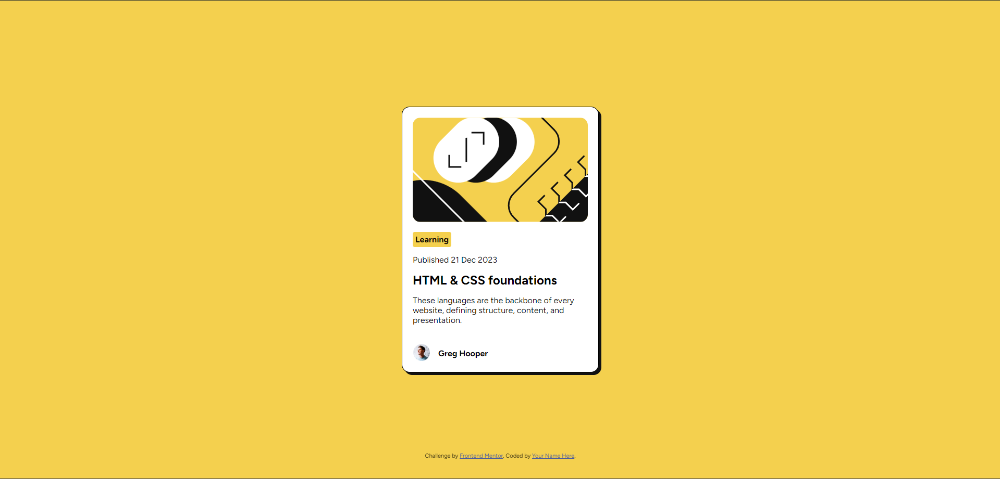
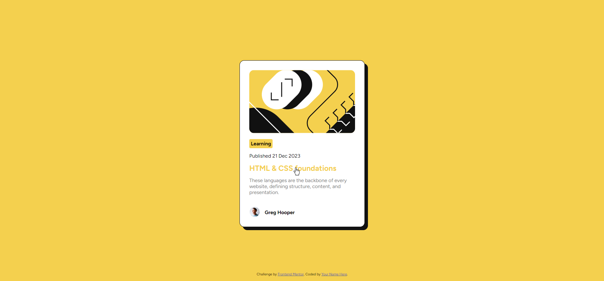

# Frontend Mentor - Blog preview card solution

This is a solution to the [Blog preview card challenge on Frontend Mentor](https://www.frontendmentor.io/challenges/blog-preview-card-ckPaj01IcS). Frontend Mentor challenges help you improve your coding skills by building realistic projects.

## Table of contents

- [Overview](#overview)
  - [The challenge](#the-challenge)
  - [Screenshot](#screenshot)
  - [Links](#links)
  - [Built with](#built-with)
  - [What I learned](#what-i-learned)
  - [Useful resources](#useful-resources)

## Overview

### The challenge

Users should be able to:

- See hover and focus states for all interactive elements on the page

### Screenshot

Passive State

Active State:

### Links

- Solution URL: [here](https://github.com/Yahia-kilany/blog-preview-card-main)
- Live Site URL: [ here](https://yahia-kilany.github.io/blog-preview-card-main/)

### Built with

- Semantic HTML5 markup
- CSS custom properties
- Flexbox

### What I learned

* how to create box shadows.
* creating hover interactions
* got more familiar with styling classes and figuring out the margins I should use

### Useful resources

- https://www.w3schools.com - invaluable rescourse for rechecking css and html properties.
